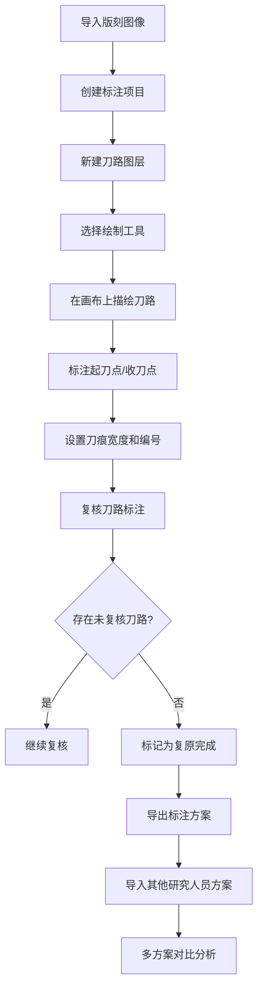
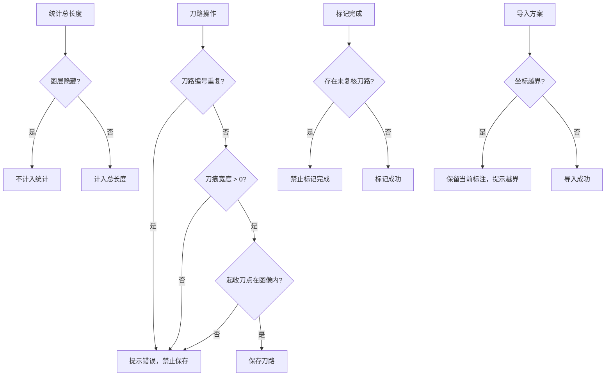

## 1. 产品概述

古籍木刻版面图像复原系统，用于根据古籍木刻版面图像复原刻刀走向和刻线层级。系统面向古籍研究人员、文献修复专家，提供数字化刀路标注、图层管理和多方案对比功能，助力木刻版刻工艺研究和数字化复原。

## 2. 核心功能

### 2.1 用户角色

| 角色 | 注册方式 | 核心权限 |
|------|----------|----------|
| 研究人员 | 本地应用，无需注册 | 导入图像、标注刀路、管理图层、导出方案、对比标注 |

### 2.2 功能模块

1. **工作台主页**：图像画布、刀路标注工具栏、图层管理面板、属性编辑面板
2. **标注方案管理**：方案导入/导出、多研究人员标注方案对比
3. **统计面板**：刀路长度统计、复核进度展示

### 2.3 页面详情

| 页面名称 | 模块名称 | 功能描述 |
|----------|----------|----------|
| 工作台主页 | 图像画布区域 | 显示导入的版刻图像，支持缩放、平移，Konva.js 绘制刀路路径 |
| 工作台主页 | 刀路绘制工具栏 | 绘制模式切换（自由绘制、折线绘制）、标注工具（起刀点、收刀点、修版标记） |
| 工作台主页 | 图层管理面板 | 新建图层、显示/隐藏、删除、颜色设置、上下移动 |
| 工作台主页 | 属性编辑面板 | 刀路编号、刀痕宽度、复核状态、备注信息编辑 |
| 工作台主页 | 统计信息栏 | 总刀路数、总长度、未复核数、完成状态 |
| 方案对比模态框 | 方案列表 | 导入多个标注方案，选择对比 |
| 方案对比模态框 | 差异展示 | 叠加对比不同研究人员的刀路标注差异 |

## 3. 核心流程

### 业务规则约束流程

## 4. 用户界面设计

### 4.1 设计风格

- **主色调**：古籍书卷风格，米白色背景（#F5F0E6），深棕文字（#3D2B1F）
- **强调色**：朱砂红（#C41E3A）用于刀路选中状态，石青蓝（#1D4E89）用于图层标识
- **辅助色**：墨绿（#2E5D3B）用于复核完成标记，橙黄（#E8A838）用于未复核提示
- **字体**：标题使用「思源宋体」，正文使用「思源黑体」，营造古籍研究氛围
- **布局**：三栏布局，左侧工具栏，中间画布，右侧属性面板
- **视觉细节**：仿古纸张纹理背景，浅木色边框，书卷式标签页

### 4.2 页面设计概述

| 页面名称 | 模块名称 | UI 元素 |
|----------|----------|----------|
| 工作台主页 | 顶部导航栏 | 项目标题、导入图像按钮、导出方案按钮、方案对比按钮、完成状态标记 |
| 工作台主页 | 左侧工具栏 | 绘制模式图标组（自由绘制、折线、橡皮擦）、标注工具（起刀点、收刀点、修版标记）、撤销/重做 |
| 工作台主页 | 中间画布区 | 带纸张纹理背景的 Konva 画布、图像显示、刀路路径叠加、缩放控制条 |
| 工作台主页 | 右侧面板 | 图层列表（带颜色标签、眼睛图标、锁图标）、刀路属性表单、统计卡片 |
| 方案对比模态框 | 方案选择区 | 可勾选的方案列表、研究人员名称、导入时间 |
| 方案对比模态框 | 对比画布区 | 半透明叠加显示、不同方案使用不同色相、图例说明 |

### 4.3 响应式设计

- **桌面端优先**：1280px 及以上为完整三栏布局
- **中等屏幕（960-1279px）**：右侧面板可折叠，使用抽屉式展示
- **小屏幕（<960px）**：不支持，提示使用桌面端进行标注工作

### 4.4 交互细节

- 画布缩放：鼠标滚轮缩放，按住空格拖拽平移
- 刀路悬停：显示刀路编号和长度提示框
- 刀路选中：高亮描边，两端控制点可拖拽调整
- 图层切换：平滑过渡动画，隐藏图层渐隐效果
- 错误提示：Naive UI Message 组件，红色警告样式
