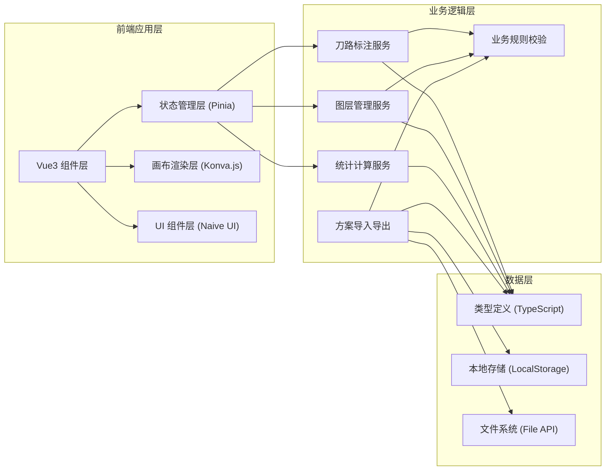
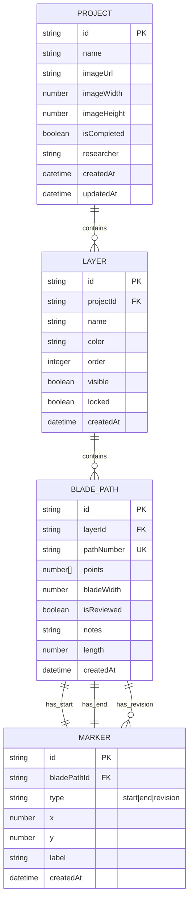

## 1. 架构设计



## 2. 技术描述

- **前端框架**：Vue 3.4.x + Composition API + `<script setup>`
- **类型系统**：TypeScript 5.3.x
- **状态管理**：Pinia 2.1.x
- **画布渲染**：konva 9.3.x + vue-konva 3.1.x
- **UI 组件库**：naive-ui 2.38.x
- **构建工具**：Vite 5.0.x
- **CSS 框架**：Tailwind CSS 3.4.x
- **图标库**：@vicons/ionicons5 0.12.x
- **初始化工具**：vite-init

## 3. 目录结构

```
src/
├── components/
│   ├── canvas/
│   │   ├── KonvaCanvas.vue        # Konva 画布主组件
│   │   ├── BladePathRenderer.vue  # 单条刀路渲染组件
│   │   ├── MarkerRenderer.vue     # 标注点渲染组件
│   │   └── ImageLayer.vue         # 底图图层组件
│   ├── toolbar/
│   │   ├── DrawToolbar.vue        # 绘制工具栏
│   │   └── ToolButton.vue         # 工具按钮组件
│   ├── panel/
│   │   ├── LayerPanel.vue         # 图层管理面板
│   │   ├── PropertyPanel.vue      # 属性编辑面板
│   │   └── StatsPanel.vue         # 统计信息面板
│   ├── dialog/
│   │   ├── CompareDialog.vue      # 方案对比对话框
│   │   └── ImportDialog.vue       # 导入对话框
│   └── common/
│       ├── HeaderBar.vue          # 顶部导航栏
│       └── ConfirmModal.vue       # 确认弹窗
├── stores/
│   ├── canvasStore.ts             # 画布状态管理
│   ├── layerStore.ts              # 图层状态管理
│   ├── bladePathStore.ts          # 刀路状态管理
│   └── projectStore.ts            # 项目状态管理
├── composables/
│   ├── useCanvasInteraction.ts    # 画布交互逻辑
│   ├── useBladePathDrawing.ts     # 刀路绘制逻辑
│   ├── useBusinessRules.ts        # 业务规则校验
│   └── useStatsCalculation.ts     # 统计计算逻辑
├── types/
│   ├── index.ts                   # 类型定义入口
│   ├── bladePath.ts               # 刀路相关类型
│   ├── layer.ts                   # 图层相关类型
│   ├── marker.ts                  # 标注点相关类型
│   └── project.ts                 # 项目相关类型
├── utils/
│   ├── geometry.ts                # 几何计算工具
│   ├── validation.ts              # 校验工具函数
│   ├── export.ts                  # 导出工具函数
│   └── import.ts                  # 导入工具函数
├── pages/
│   └── Workbench.vue              # 工作台主页
├── App.vue
├── main.ts
└── assets/
    └── styles/
        └── global.css             # 全局样式
```

## 4. 路由定义

| 路由 | 页面 | 用途 |
|------|------|------|
| / | Workbench.vue | 工作台主页，包含所有标注功能 |

## 5. 数据模型

### 5.1 数据模型定义



### 5.2 TypeScript 类型定义

```typescript
// types/bladePath.ts
export interface Point {
  x: number
  y: number
}

export type MarkerType = 'start' | 'end' | 'revision'

export interface Marker {
  id: string
  bladePathId: string
  type: MarkerType
  x: number
  y: number
  label?: string
  createdAt: number
}

export interface BladePath {
  id: string
  layerId: string
  pathNumber: string
  points: Point[]
  bladeWidth: number
  isReviewed: boolean
  notes: string
  length: number
  startMarker?: Marker
  endMarker?: Marker
  revisionMarkers: Marker[]
  createdAt: number
}

// types/layer.ts
export interface Layer {
  id: string
  projectId: string
  name: string
  color: string
  order: number
  visible: boolean
  locked: boolean
  createdAt: number
}

// types/project.ts
export interface ProjectImage {
  url: string
  width: number
  height: number
  name: string
}

export interface AnnotationScheme {
  id: string
  researcher: string
  projectName: string
  image: ProjectImage
  layers: Layer[]
  bladePaths: BladePath[]
  isCompleted: boolean
  importedAt?: number
}

export interface ProjectState {
  currentScheme: AnnotationScheme | null
  compareSchemes: AnnotationScheme[]
}
```

## 6. 核心业务规则实现

### 6.1 业务规则校验函数

| 规则 | 校验函数 | 返回值 |
|------|----------|--------|
| 刀路编号不能重复 | `validatePathNumberUnique(number, excludeId)` | boolean |
| 刀痕宽度 > 0 | `validateBladeWidth(width)` | boolean |
| 起收刀点在图像内 | `validatePointInImage(point, imageSize)` | boolean |
| 隐藏图层不计入统计 | 计算时过滤 `visible: false` | - |
| 未复核刀路不能标记完成 | `hasUnreviewedPaths()` | boolean |
| 导入坐标越界检查 | `validateSchemeBounds(scheme, imageSize)` | { valid: boolean; invalidPaths: string[] } |

### 6.2 核心计算函数

| 功能 | 函数 | 说明 |
|------|------|------|
| 计算刀路长度 | `calculatePathLength(points: Point[])` | 基于欧几里得距离计算折线总长度 |
| 统计总刀路长度 | `calculateTotalLength(layerIds?: string[])` | 仅统计可见图层 |
| 统计未复核数量 | `getUnreviewedCount()` | 统计所有未复核刀路 |
| 检查编号重复 | `findDuplicatePathNumbers()` | 返回所有重复编号 |

## 7. Pinia Store 设计

### 7.1 bladePathStore

```typescript
- state: { bladePaths: Map<string, BladePath> }
- getters:
  - getAllBladePaths(): BladePath[]
  - getBladePathsByLayer(layerId): BladePath[]
  - getVisibleBladePaths(): BladePath[]
  - getTotalLength(): number
  - getUnreviewedCount(): number
  - hasDuplicateNumbers(): boolean
- actions:
  - addBladePath(path: BladePath): ValidationResult
  - updateBladePath(id, updates): ValidationResult
  - deleteBladePath(id): void
  - toggleReview(id): void
  - validateBladePath(path): ValidationResult
```

### 7.2 layerStore

```typescript
- state: { layers: Layer[] }
- getters:
  - visibleLayers(): Layer[]
  - sortedLayers(): Layer[]
- actions:
  - addLayer(name, color): Layer
  - updateLayer(id, updates): void
  - deleteLayer(id): void
  - moveLayer(id, direction): void
  - toggleVisibility(id): void
```

### 7.3 projectStore

```typescript
- state: { 
    currentProject: AnnotationScheme | null
    compareSchemes: AnnotationScheme[]
    imageSize: { width: number; height: number } | null
  }
- actions:
  - importImage(file): Promise<void>
  - exportScheme(): string
  - importScheme(json: string): ValidationResult
  - markAsComplete(): ValidationResult
  - addCompareScheme(scheme): void
  - removeCompareScheme(id): void
```
